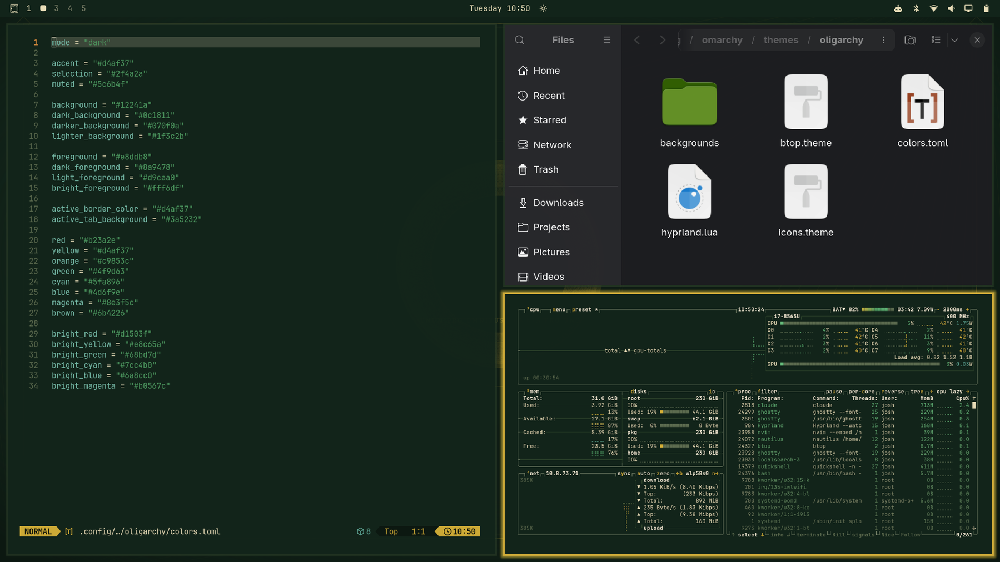
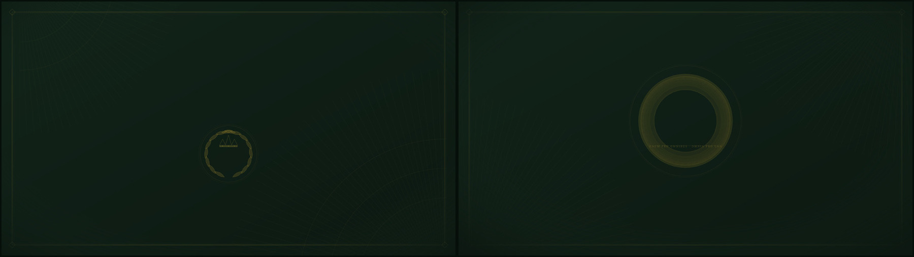

# Omarchy Oligarchy Theme

A dark, gilded theme for [Omarchy](https://omarchy.org) for the working
few: money-green surfaces, ivory parchment text, and a gold accent doing
all the talking. Rule by committee has never looked this good.





## Install

```bash
omarchy theme install https://github.com/jsquared43/omarchy-oligarchy-theme
```

## Palette

| Role | Hex |
| --- | --- |
| Background | `#12241a` |
| Dark background | `#0c1811` |
| Darker background | `#070f0a` |
| Lighter background | `#1f3c2b` |
| Foreground | `#e8ddb8` |
| Accent | `#d4af37` |
| Selection | `#2f4a2a` |
| Muted | `#5c6b4f` |

Full ANSI palette in [`colors.toml`](colors.toml). Icons are `Yaru-olive`.

## Backgrounds

- **The Seal** — a laurel wreath wrapped around a crown, set inside a
  medallion like an official stamp of approval.
- **The Mint** — a banknote-style guilloché rosette, engraved underneath
  with the motto *"UNUM PRO OMNIBUS · OMNIA PRO UNO"* — one for all, all
  for the one.
